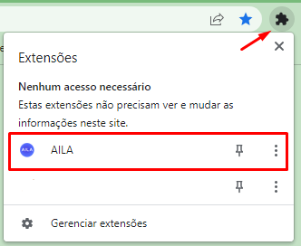
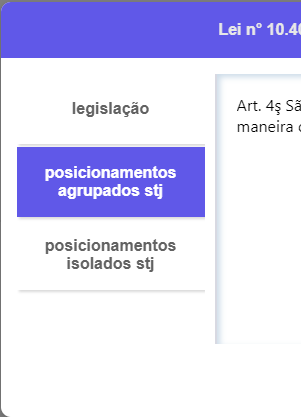
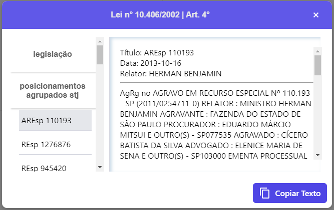
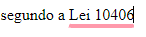

Como Configurar o AILA
----------------------

O AILA funciona atravez de um plug-in para o google chrome, para configurá-lo basta carregar no seu navegador, para isso siga os seguintes passos

ao abrir o chrome no canto superior direito clique no botão de extensões

apos isso clique no botão gerenciar de extensões

ao abrir a aba de gerenciar extensões clique em carregar sem compactação, ele ira abrir o explorador de arquivos nele você deve selecionar a pasta aonde se encontra o arquivo do AILA, apos isso ele devera carregar a extensão para a aba de gerenciar extensões

verifique se a extensão foi carregada corretamente, caso isso ocorra ela deverá aparecer dessa forma:

Verrifique também se a extensão está habilitada no seu navegador google chrome

após concluir esses passos clique novamente no botão de extensões no canto superior direiro, agora devera aparecer a extensão nele

não se esqueça de selecionar o botão para fixar a extensão na sua barra de tarefas do seu navegador

tendo feito isso a extensão devera aparecer fixada no canto superior facilitando seu acesso

agora basta clicar nela e clicar em iniciar para poder utilizar a extensão

não se esqueça de selecionar o botão para fixar a extensão na sua barra de tarefas do seu navegdor

tendo feito isso a extensão deverá aparecer fixada no canto superior facilitando seu acesso

agora basta clicar nela e clicar em iniciar para poder utilizar a extensão

Como Usar o AILA
----------------

O AILA funciona através de um plug-in para o google chrome, para configuralo basta carregar no seu navegador, para isso siga os seguintes passos

Após configurar o plug-in, para começar a utilizá-lo, basta clicar no botão de iniciar (no canto inferior esquerdo)

apos iniciar, no canto superior direito da pagina irá aparecer o botão que abre a aba de consultas

essa é a aba de consultas. Quando uma legislação ou um dispositivo for detectado na padronização mais adequada ela irá aparecer nessa aba, como nesse exemplo o CC (Codigo Civil)

ainda na aba lateral de consultas ao clicar em um dos itens ira abrir um pop-up mostrando mais informações sobre o elemento desejado

nesse exemplo a aba lateral está mostrando a legislação da lei 10406 pareada com o artigo quarto, quando o pop-up abre normalmente ele exibe o texto inicial referente a legislação ou ao dispositivo, para fechar essa aba de pop-up clique no botão direito superior onde tem "x", ou precione a tecla "esc" no seu teclado

observe essa barra lateral no pop-up, nela você pode navegar e examinar melhor os elementos da consulta

nesse caso, ao clicar em posicionamento agrupados do stj, ele expande e abre uma lista com todas as jurisprudências encontradas que correspondem aos posicionamentos agrupados

ao clicar em uma jurisprudência ele vai alterar o conteudo da janela de visualização com o conteudo da jurisprudência, o botão no canto inferior direito copia o texto que esta sendo exibido na janela de visualização, nesse caso essa jurisprudência específica, o texto fica na area de tranferência do seu computador, ou seja basta apertar CTRL + V ou clicar com botão direito do mouse e na opção colar, para colar o texto onde quiser

ainda na aba lateral também é possivel visualizar os posicionamentos isolados da mesma forma dos agrupados

quando a peticão estiver sendo escrita caso o plug-in estaja ativado, ele ira marcar padrões de citações que ele detectou e que as considere não tão indicadas, essas ficarão sublinhadas em vermelho

ao passar o mouse por cima essas citações marcadas ficaram destacadas

ao clicar em cima dessas marcações se abrira um pop-up de sugestão, para fechalo e ignorar a sugestão feita pela ferramenta basta clicar no "x" no canto superior direito do pop-up, ao clicar na sugestao ele ira substituir a citação pela forma que ele identificou como mais adequada

aqui um exemplo do texto apos substituido

 
